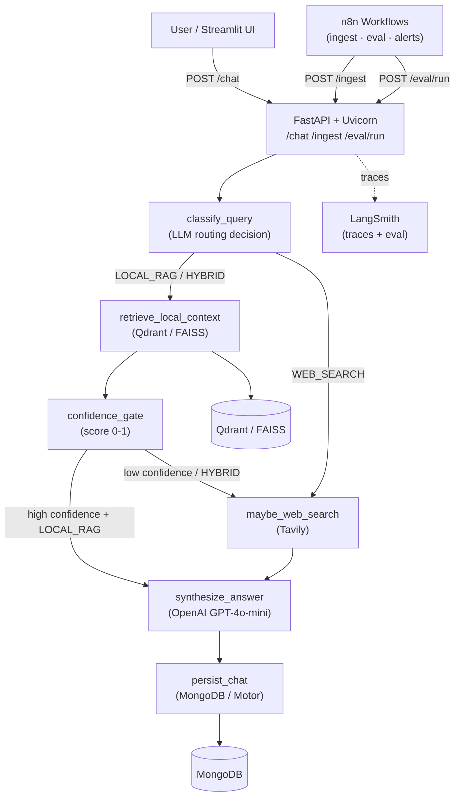

# Adaptive RAG Ops Lab

A production-style, local-first **Adaptive Research Copilot** that routes questions to local vector search, live web search, or a hybrid of both — automatically.

## Architecture



## Tech Stack

| Component | Technology |
|-----------|------------|
| **LLM Framework** | LangChain |
| **Workflow Orchestration** | LangGraph |
| **Web Framework** | FastAPI |
| **ASGI Server** | Uvicorn |
| **UI** | Streamlit |
| **Vector DB** | Qdrant (default) / FAISS (fallback) |
| **Chat DB** | MongoDB / Motor (async) |
| **Document Processing** | LangChain Community (loaders + splitters) |
| **LLM / Embeddings** | OpenAI |
| **Web Search** | Tavily |
| **Data Validation** | Pydantic v2 |
| **Workflow Automation** | n8n |
| **Observability** | LangSmith |

### Broader AI Agent & LLM Tooling Landscape
| Tool Type                                  | Description                                                                                                          | Example Tools                                          | Main Features                                                                                            |
| ------------------------------------------ | -------------------------------------------------------------------------------------------------------------------- | ------------------------------------------------------ | -------------------------------------------------------------------------------------------------------- |
| **LLM Application Framework**              | Libraries to build LLM apps (RAG, tools, prompts). Provide abstractions for models, prompts, memory, and retrieval.  | LangChain, LlamaIndex, Haystack, DSPy                  | Prompt templates, chains, tool calling, memory, vector DB integration, optimizable prompting             |
| **Agent Workflow Orchestration**           | Frameworks to design complex agent workflows with control flow, state, and multi-agent coordination.                 | LangGraph, AutoGen, Semantic Kernel                    | Graph/state machines, multi-agent coordination, tool routing, loops, human-in-the-loop                   |
| **Agent Collaboration Frameworks**         | Tools focused on role-based teams of AI agents collaborating on tasks.                                               | CrewAI, AutoGen, AgentScope                            | Role-based agents, collaborative reasoning, shared context, task delegation                              |
| **Visual / Low-Code AI Workflow Builders** | GUI tools for building AI workflows or automation pipelines using drag-and-drop nodes.                               | n8n, Langflow, Flowise, Dify                           | Drag-and-drop pipelines, connectors to APIs, triggers, scheduling, simple AI agents                      |
| **No-Code Business Automation**            | No-code platforms for automating business workflows with optional AI steps.                                          | Make (Integromat), Zapier                              | Visual workflow builder, 1000s of app integrations, triggers, scheduled runs                             |
| **LLM Observability & Evaluation**         | Platforms for tracing, debugging, evaluating, and monitoring LLM applications in production.                         | Langfuse, LangSmith, Arize Phoenix, Braintrust, Weave  | Tracing LLM calls, prompt versioning, experiment tracking, evaluation datasets, cost & latency analytics |
| **Durable Workflow / Execution Engines**   | Infrastructure tools for long-running workflows and reliable agent execution with retries and state persistence.      | Temporal, Apache Airflow, Prefect                      | Durable workflows, retries, state persistence, distributed scheduling, fault tolerance                   |
| **Managed Agent Platforms**                | Fully managed cloud platforms for deploying and running AI agents without managing infrastructure.                   | OpenAI Assistants API, Vertex AI Agent Builder, Amazon Bedrock Agents | Built-in memory, tool use, file retrieval, hosted execution, managed scaling               |

### Where each tool fits
| Tool                       | Category                    | Role                                              |
| -------------------------- | --------------------------- | ------------------------------------------------- |
| LangChain                  | LLM framework               | Build RAG pipelines, chains, and tool-using apps  |
| LlamaIndex                 | LLM framework               | Data ingestion, indexing, and RAG                 |
| Haystack                   | LLM framework               | Production RAG and NLP pipelines                  |
| DSPy                       | LLM framework               | Optimize prompts and LLM pipelines programmatically |
| LangGraph                  | Agent orchestration         | Build stateful, graph-based agent workflows       |
| AutoGen                    | Agent orchestration + collab | Multi-agent conversations and task execution      |
| Semantic Kernel            | Agent orchestration         | Enterprise agent workflows with .NET/Python SDK   |
| CrewAI                     | Agent collaboration         | Role-based multi-agent teams                      |
| AgentScope                 | Agent collaboration         | Distributed multi-agent framework                 |
| n8n                        | Low-code automation         | Integrate APIs + AI steps with visual flows       |
| Langflow                   | Low-code AI builder         | Visual builder for LangChain-based pipelines      |
| Flowise                    | Low-code AI builder         | Drag-and-drop LLM app builder                     |
| Dify                       | Low-code AI builder         | LLM app platform with prompt IDE and agent UI     |
| Make (Integromat)          | No-code automation          | Business automation workflows                     |
| Zapier                     | No-code automation          | Trigger-based app integrations                    |
| Langfuse                   | Observability               | Open-source LLM tracing and evaluation            |
| LangSmith                  | Observability               | LangChain-native tracing, evaluation, datasets    |
| Arize Phoenix              | Observability               | LLM tracing, evaluation, and drift detection      |
| Braintrust                 | Observability               | Experiment tracking and evals for LLM apps        |
| Weave                      | Observability               | Lightweight tracing and eval (by Weights & Biases)|
| Temporal                   | Execution engine            | Durable, fault-tolerant long-running workflows    |
| Apache Airflow             | Execution engine            | Scheduled DAG-based workflow orchestration        |
| Prefect                    | Execution engine            | Modern dataflow and agent task orchestration      |
| OpenAI Assistants API      | Managed agent platform      | Hosted agents with memory, tools, and file access |
| Vertex AI Agent Builder    | Managed agent platform      | Google Cloud managed agent deployment             |
| Amazon Bedrock Agents      | Managed agent platform      | AWS managed agents with RAG and tool use          |

## Project Structure

```
adaptive-rag/
├── backend/
│   ├── api/
│   │   ├── main.py          # FastAPI app factory + LangSmith setup
│   │   ├── routes.py        # /health /ingest /chat /eval/run
│   │   ├── schemas.py       # Pydantic request/response models
│   │   └── dependencies.py  # DI: settings, vector store, chat repo
│   ├── orchestrator/
│   │   ├── graph.py         # LangGraph StateGraph + conditional routing
│   │   ├── nodes.py         # All graph node implementations
│   │   ├── state.py         # GraphState + RouteDecision
│   │   ├── prompts.py       # LangChain prompt templates
│   │   └── eval.py          # LangSmith dataset + eval pipeline
│   ├── data/
│   │   ├── config.py        # Pydantic Settings (env-based)
│   │   ├── vector_store.py  # Qdrant + FAISS adapters
│   │   ├── chat_repo.py     # Motor MongoDB + in-memory fallback
│   │   └── ingestion.py     # LangChain Community loaders/splitters
│   └── tests/
│       ├── conftest.py
│       ├── test_graph_routing.py   # LOCAL_RAG / WEB_SEARCH / HYBRID routes
│       ├── test_api.py             # API contract tests
│       ├── test_data_layer.py      # Vector + chat repo tests
│       ├── test_eval_pipeline.py   # Eval report artifact tests
│       └── test_streamlit_smoke.py # Streamlit smoke test
├── frontend/
│   └── streamlit_app.py     # Chat UI with route badges + source citations
├── workflows/
│   └── n8n/
│       ├── doc_ingestion_workflow.json
│       ├── nightly_eval_workflow.json
│       └── regression_alert_workflow.json
├── infra/
│   └── docker-compose.yml   # MongoDB + Qdrant + n8n (optional)
├── scripts/
│   ├── start_backend.sh
│   ├── start_frontend.sh
│   └── run_tests.sh
├── .env.example
└── pyproject.toml
```

## Setup

### Prerequisites

- Python 3.12+
- [uv](https://docs.astral.sh/uv/) (`pip install uv`)
- Docker + Docker Compose (for local infra)

### 1. Clone and install

```bash
git clone <repo-url>
cd adaptive-rag

uv sync
```

### 2. Configure environment

```bash
cp .env.example .env
# Edit .env — at minimum set OPENAI_API_KEY and TAVILY_API_KEY
```

For **FAISS fallback** (no Qdrant needed), set:
```
FEATURE_VECTOR_BACKEND=faiss
MONGODB_URI=memory://
```

### 3. Start local infrastructure

```bash
# MongoDB + Qdrant only
docker compose -f infra/docker-compose.yml up -d mongodb qdrant

# With n8n workflow automation
docker compose -f infra/docker-compose.yml --profile n8n up -d
```

## Run Commands

### Backend (FastAPI + Uvicorn)

```bash
bash scripts/start_backend.sh
# or directly:
uvicorn backend.api.main:app --host 0.0.0.0 --port 8000 --reload
```

### Frontend (Streamlit)

```bash
API_BASE_URL=http://localhost:8000 bash scripts/start_frontend.sh
# or directly:
streamlit run frontend/streamlit_app.py
```

### Tests

```bash
bash scripts/run_tests.sh
# or:
uv run pytest -v
```

## How Adaptive Routing Works

Every `/chat` request flows through a LangGraph state machine:

1. **`classify_query`** — An LLM analyzes the question and returns one of:
   - `LOCAL_RAG` — answer likely in local docs
   - `WEB_SEARCH` — needs fresh/external data
   - `HYBRID` — use both

2. **`retrieve_local_context`** — Top-k documents from Qdrant/FAISS (skipped for `WEB_SEARCH`)

3. **`confidence_gate`** — LLM scores local context 0–1. If score < `CONFIDENCE_THRESHOLD` (default 0.7) or route is `HYBRID`, falls through to web search

4. **`maybe_web_search`** — Tavily API fetches top-5 live results

5. **`synthesize_answer`** — GPT-4o-mini generates a cited answer from all context

6. **`persist_chat`** — User + assistant messages saved to MongoDB

The Streamlit UI shows a route badge (`🟢 LOCAL_RAG`, `🌐 WEB_SEARCH`, `🔀 HYBRID`) plus confidence score, latency, and token usage for every response.

## LangSmith Traces & Evals

Every request is traced automatically when `LANGSMITH_TRACING=true` and `LANGSMITH_API_KEY` is set.

View traces at [smith.langchain.com](https://smith.langchain.com) under project `adaptive-rag-ops-lab`.

### Run an eval

```bash
curl -X POST http://localhost:8000/eval/run
```

This will:
1. Create (or reuse) a dataset named `adaptive-rag-eval-v1` in LangSmith with 3 seed Q&A examples
2. Run the pipeline against each example
3. Score keyword relevance
4. Write `eval_reports/eval_report_<timestamp>.json` and `.md`

## Example API Calls

### Health check

```bash
curl http://localhost:8000/health
```

### Ingest a document

```bash
curl -X POST http://localhost:8000/ingest \
  -H "Content-Type: application/json" \
  -d '{"file_path": "/path/to/paper.pdf"}'
```

### Chat

```bash
curl -X POST http://localhost:8000/chat \
  -H "Content-Type: application/json" \
  -d '{"question": "What is retrieval-augmented generation?"}'
```

### Continue a session

```bash
curl -X POST http://localhost:8000/chat \
  -H "Content-Type: application/json" \
  -d '{"question": "How does it differ from fine-tuning?", "session_id": "<session_id>"}'
```

### Get session history

```bash
curl http://localhost:8000/chat/<session_id>
```

## n8n Workflows

Import any of the three JSON files from `workflows/n8n/` into your n8n instance:

| Workflow | Trigger | Action |
|----------|---------|--------|
| `doc_ingestion_workflow.json` | Webhook `POST /ingest-docs` | Calls `/ingest`, logs result |
| `nightly_eval_workflow.json` | Cron `02:00` daily | Calls `/eval/run`, writes summary |
| `regression_alert_workflow.json` | Cron `02:30` daily | Calls `/eval/run`, sends Slack alert if score < `EVAL_THRESHOLD` |

Set `API_BASE_URL` in n8n environment variables to point at your backend.

## Troubleshooting

**`pydantic_settings` not found**
```bash
uv add pydantic-settings
```

**Qdrant connection refused**
```bash
docker compose -f infra/docker-compose.yml up -d qdrant
# or switch to FAISS: FEATURE_VECTOR_BACKEND=faiss
```

**MongoDB connection refused**
```bash
docker compose -f infra/docker-compose.yml up -d mongodb
# or use in-memory: MONGODB_URI=memory://
```

**LangSmith traces not appearing** — ensure `LANGSMITH_API_KEY` and `LANGSMITH_PROJECT` are set in `.env` and `LANGSMITH_TRACING=true`.

**`faiss-cpu` not installed** — uncomment `faiss-cpu` in `pyproject.toml` and run `uv sync`.

---

## What to Learn Next

- **Hybrid retrieval**: combine dense (OpenAI embeddings) + sparse (BM25 via `langchain-community`) with RRF fusion
- **Reranker**: add `FlashrankRerank` or Cohere Rerank between retrieval and synthesis
- **Response caching**: Redis-based semantic cache using `langchain-community.cache.RedisSemanticCache`
- **Multi-tenant namespacing**: Qdrant collection-per-tenant via request header routing in FastAPI
- **CI pipeline**: GitHub Actions with pytest + ruff + eval regression gate (fail if `avg_keyword_relevance` drops below threshold)

---

## Acceptance Checklist

| Technology | Evidence |
|-----------|----------|
| LangChain | `orchestrator/prompts.py` — `ChatPromptTemplate`, `PromptTemplate`; chains used in every node |
| LangGraph | `orchestrator/graph.py` — `StateGraph` with 6 nodes + 2 conditional routing edges |
| FastAPI | `api/routes.py` — async handlers for all 5 endpoints |
| Uvicorn | `scripts/start_backend.sh` + direct uvicorn command |
| Streamlit | `frontend/streamlit_app.py` — full chat UI |
| Qdrant | `data/vector_store.py` `QdrantAdapter` — default path |
| FAISS | `data/vector_store.py` `FAISSAdapter` — enabled via `FEATURE_VECTOR_BACKEND=faiss` |
| MongoDB | `data/chat_repo.py` `ChatRepository` using Motor |
| Motor | `AsyncIOMotorClient` in `chat_repo.py` |
| LangChain Community | `data/ingestion.py` — `PyPDFLoader`, `UnstructuredMarkdownLoader`, `BSHTMLLoader`, `RecursiveCharacterTextSplitter` |
| OpenAI | `langchain_openai.ChatOpenAI` + `OpenAIEmbeddings` throughout orchestrator |
| Tavily | `orchestrator/nodes.py` `maybe_web_search` using `TavilyClient` |
| Pydantic | `api/schemas.py`, `data/config.py` — strict v2 models and Settings |
| n8n | `workflows/n8n/` — 3 importable workflow JSONs |
| LangSmith | `api/main.py` tracing setup; `orchestrator/eval.py` dataset + eval pipeline; `@traceable` decorators on nodes |
